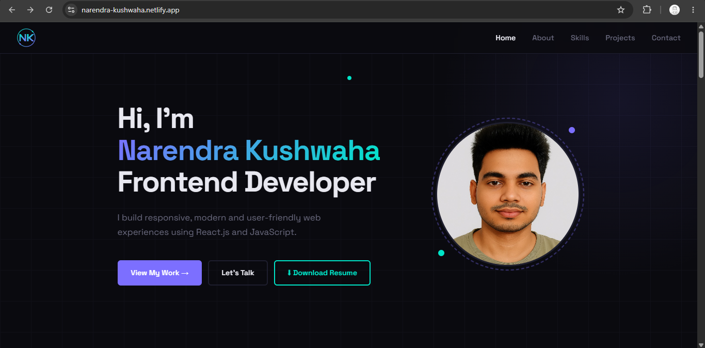

# Developer Portfolio

A modern and responsive developer portfolio website built to showcase my skills, projects, and frontend development journey.

## Features

- Responsive design for all devices
- Modern dark theme UI
- Smooth scrolling navigation
- About section with profile information
- Technical skills showcase
- Project showcase with details
- Contact form
- Resume download option

## Tech Stack

Frontend:
- HTML5
- CSS3
- JavaScript

Tools:
- Git
- GitHub
- VS Code

## Sections

- Home
- About
- Skills
- Projects
- Contact

## Project Highlights

- Clean and responsive user interface
- Modern UI design
- Reusable UI sections
- Interactive frontend elements
- Optimized layout for better user experience

## Screenshots

## Live Demo

https://narendra-kushwaha-portfolio.vercel.app/

## GitHub Repository

https://github.com/Narendra-kushwaha/portfolio

## 👨‍💻 Author

Narendra Kushwaha
